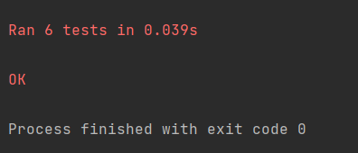

Лабораторная работа номер 4

Цель работы: Изучить принципы работы unit тестов.
Задание:
Написать unit тесты для 1 варианта из лабораторной работы №3.

Вычисление тригонометрических
функций с заданной точностью, выбор градусов или радиан.

